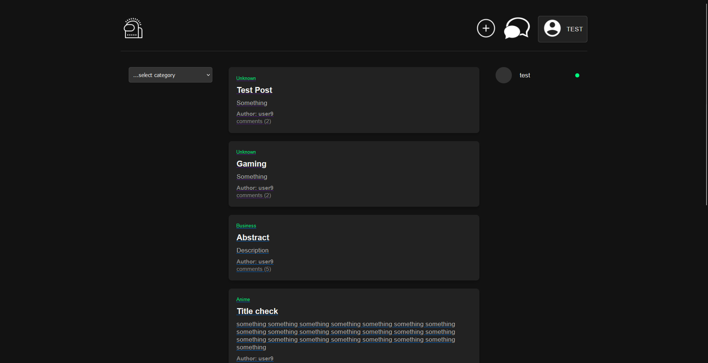
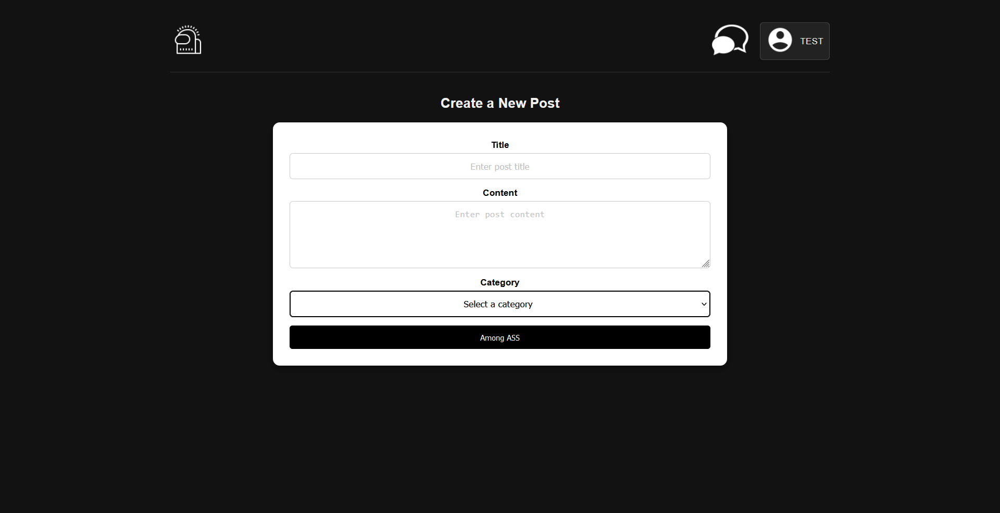
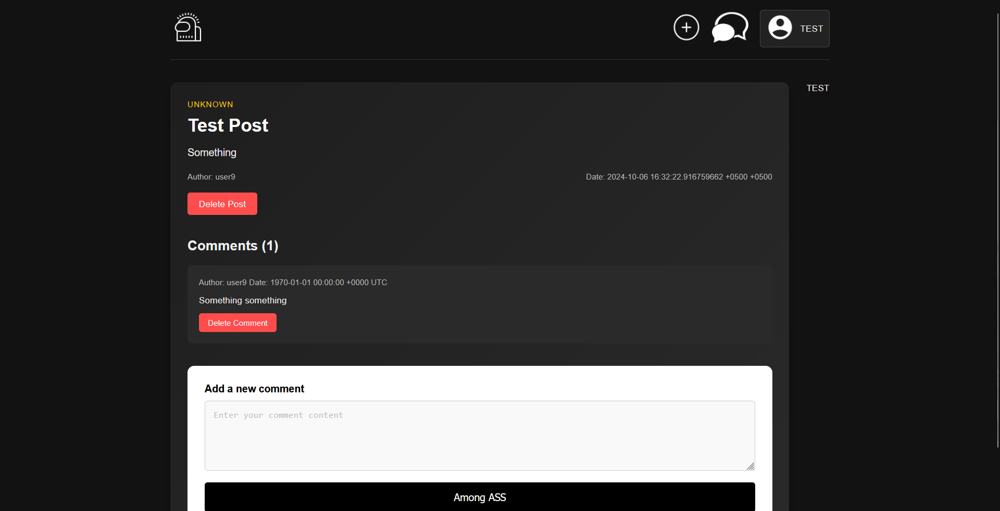
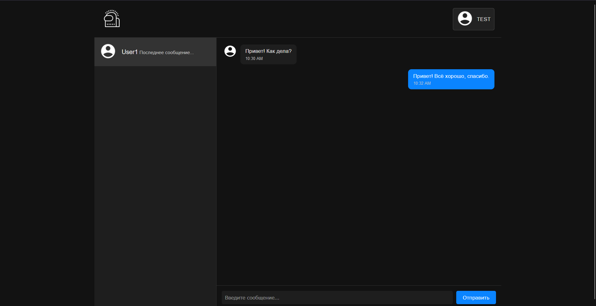
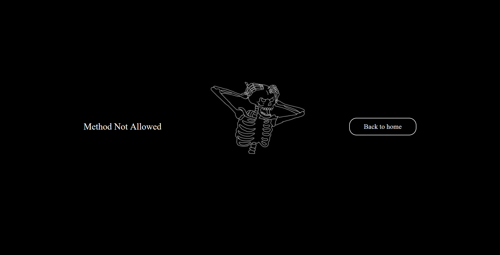

# Introduction

The Real-Time Forum is an advanced web application designed to facilitate dynamic interactions among users through features like post creation, commenting, live messaging, and more, all in real-time. This project builds upon a previous forum model, enhancing its capabilities with real-time data exchange using WebSockets, a single-page application (SPA) architecture, and a blend of technologies including SQLite, Golang, JavaScript, HTML, and CSS.

## Preview 











# Getting start 

## Clone the repository
```
git clone https://01.kood.tech/git/dpruel/real-time-forum.git
```

## Usage 

While in the root directory of the project, type in the console

```
make
```

# Authors 

Janika Pruel && Among ASS 